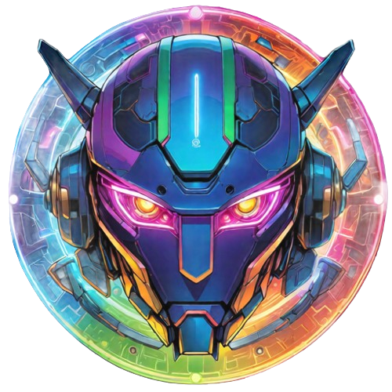

<div align="center">
  


# Sentinel

[](https://github.com/ShaharBand/Sentinel/blob/main/LICENSE)
[](https://github.com/ShaharBand/Sentinel/releases)
[](https://github.com/ShaharBand/Sentinel)
[](https://github.com/ShaharBand/Sentinel/stargazers)
[](https://www.python.org/downloads/)
[](https://github.com/ShaharBand/Sentinel/commits/main)
[](https://github.com/ShaharBand/sentinel/actions/workflows/tests.yml)
</div>

A user-friendly Command & Control (C&C) web platform for remote monitoring, management, and task automation across multiple devices.
Equipped with agents, it enables users to seamlessly execute scripted tasks on target devices, empowering efficient data retrieval and remote actions.

** Note: Its incomplete: one day i will come back to finish it but it needs some backend-frontend integration and i think some refactors..
<br>

## 🖥️ Technology Stack and Features

### Backend

- ⚡ [**FastAPI**](https://github.com/tiangolo/fastapi): for the Python backend API.
  - 🧰 [Beanie](https://github.com/roman-right/beanie): for the Python MongoDB database interactions (ODM).
  - 🔍 [Pydantic](https://github.com/samuelcolvin/pydantic): used by FastAPI, for the data validation and settings management.
  - 💾 [MongoDB](https://github.com/mongodb/mongo): as the NoSQL database.
  - 📦 [UV](https://github.com/astral-sh/uv): An extremely fast Python package and project manager.

### Frontend

- 🚀 [**React**](https://github.com/facebook/react) for the frontend.
  - 📜 [TypeScript](https://github.com/microsoft/TypeScript): Enhances JavaScript by adding types.
  - ⚡ [Vite](https://github.com/vitejs/vite): A next-generation frontend build tool for a faster and leaner development experience.
  - 💅 [EmotionJS](https://github.com/emotion-js/emotion): A library designed for writing CSS styles with JavaScript.
  - 🎨 [Material UI](https://github.com/mui/material-ui): for the frontend components.
  - 🦇 Dark mode support.

### Development and Deployment

- 🐋 [Docker Compose](https://github.com/docker/compose): for development and production.
  - 🔒 Secure password hashing by default.
  - 🔑 JWT (JSON Web Token) authentication.
  - ✅ Tests with [Pytest](https://github.com/pytest-dev/pytest).

### CI/CD

- 🚢 Deployment instructions using Docker Compose.
- 🏭 CI (continuous integration) and CD (continuous deployment) based on GitHub Actions.

<br>

## 🌱 Getting Started:

**1. Clone the repository:**

```commandline
https://github.com/ShaharBand/Sentinel.git
```

<br>

**2. Configure**

You can then update configs in the `.env` files to customize your configurations.

Before deploying it, make sure you change at least the values for:

- `DB_USER`
- `DB_PASSWORD`

You can (and should) pass the database password as environment variable from secrets.

Read the [deployment.md](deployment.md) docs for more details.

<br>

## Backend Development

Backend docs: [backend/README.md](backend/README.md).
<br><br>

## Frontend Development

Frontend docs: [frontend/README.md](frontend/README.md).
<br><br>

## Gallery Images

You can see the images of the frontend here: [gallery.md](gallery.md).
<br><br>

## 👨‍💻 Contributions:

We welcome contributions to this project! Please feel free to fork the repository and create pull requests.
<br><br>

## 💼 License:

This project is licensed under the MIT License.
